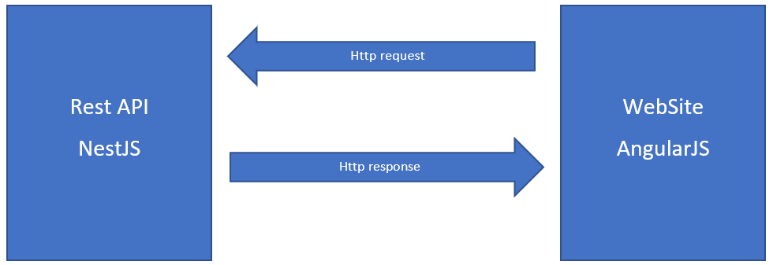

# WebProject: a BDE WebSite

By Mandel VAUBOURG, Hugo RENARD, Baptiste FISCHINI.

---

# Summary:

1. Presentation of the project
2. Presentation of the solution
3. Demonstration
4. Conclusion

---
# Presentation of the project

* A website for the CESI-EXIA's BDE
* Activities gestion
* Creation of ideas
* Users rights
* Gestion of a cart
* Social page

---
# Presentation of the solution

* restAPI - NestJs
* website  - AngularJs
---

# Architecture solution



+++
# The Database


---
# Technologies

* NestJs
* TypeORM
* Angular
* JsonWebToken
* PassportJs

---

# NestJs

* For building efficient, scalable Node.js server-side applications.
* Built in TypScript


---
# Angular

* full toolset
* Use TypeScript
* Community

+++
# Component


---
# TypeORM

* ORM based on TypeScript

---
# JsonWebToken


---
# PassportJS

* Passport is authentication middleware for Node.js.

+++ 
# Strategy

```typescript
@Component()
export class JwtStrategy extends Strategy {
  constructor(private readonly authService: AuthService) {
    super(
      {
        jwtFromRequest: ExtractJwt.fromAuthHeaderAsBearerToken(),
        passReqToCallback: true,
        secretOrKey: 'secret',
      },
      async (req, payload, next) => await this.verify(req, payload, next),
    );
    passport.use(this);
  }
  public async verify(req, payload, done) {
    const isValid = await this.authService.validateUser(payload);
    if (!isValid) {
      return done('Unauthorized', false);
    }
    done(null, payload);
  }
}
```
+++
@[1]
---
# Demonstration